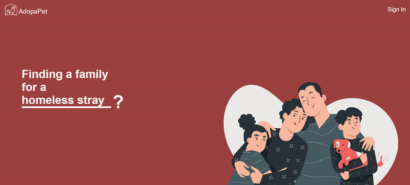

# AdopaPet--adoption-site
## Link
https://adoption-platform.web.app/

## Introduction
AdopaPet is a two-sided platform aimed to connect those looking for a new pet with shelter animals in search of a home. 

## Functionality
On one hand, it allows website users to 
  * quickly search through animal profiles using swipe gesture UX design,
  * view details of and match with animals of their choice, and 
  * book appointments with the respective rescue centers to meet the animals in person. 

On the other, these animal rescue organizations can easily
  * add and manage animal profiles,
  * view adoption application forms from interested users, and
  * manage appointment bookings of animal viewings.

## Site Demo

**Home Page**

**Profiles Page**
  * Implemented swipe gesture UX design using Interact.Js

**User Likes Page**

**Organization's Dashboard Page**

## Technologies Used

 - Fundamental Languages
    * HTML
    * CSS
    * JavaScript
 - Front-End Frameworks
    * React
    * React Router
 - Firebase
    * Storage
    * Cloud Firestore
    * Authentication
 - Other
    * Module Bundler : Webpack
    * Compiler : Babel
    * Version Control : Git / GitHub
    * Unit Testing : Jest
    * Library: Interact.Js

## Plans For Future Versions

  * Improve code efficiency by getting data from database in parts (rather than getting data all at once)
  * Allow organizations to better manage appointments by adding calander features

